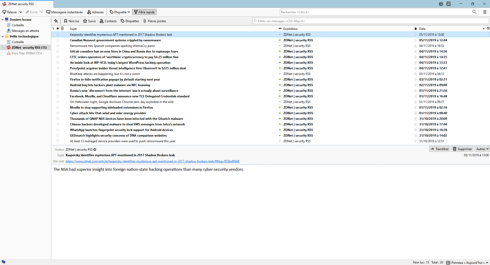

# 
💻 Veille technologique 💻

## 
Sujet : Les failles zero-day

---

### 
Introduction

 
Ce sujet est intéressant par rapport à ma spécialité de développeur (SLAM) puisque les programmes que l’on développe et que l’on développera sont et seront sujets à des failles de sécurité en tout genre, potentiellement inconnues jusqu’à ce que quelqu’un les exploitent : des failles zero-day.
 Il s’agit plus précisément de failles dont l’éditeur du logiciel (ou fournisseur de services éventuellement) n’a pas encore connaissance ou n’a pas encore apporté de correctif.

*
Illustration provenant d'un vieux projet
* 

---
### 
Méthodes de veille

 
Afin de me tenir informé d'un tel sujet, j’ai utilisé un agrégateur de flux RSS : [Mozilla Thunderbird](https://www.thunderbird.net/fr/).
 J’ai aussi utilisé le site [PolitePol](https://politepol.com/) afin de créer des flux RSS à importer dans Thunderbird (veille de type push). 
 J’ai également fait des recherches manuelles sur zdnet, [rubrique zero day](https://www.zdnet.com/blog/security), notamment en recherchant « [CVE](https://cve.mitre.org/about/index.html) » afin de trouver des articles pertinents à propos de failles zero-day (veille de type pull).

*
Capture d'écran de Mozilla Thunderbird
* 

---
### 
Développement

 
Les découvertes de telles failles sont de plus un bon moyen de gagner de l’argent : il y a même des entreprises spécialisées dans la découverte puis revente de failles zero-day aux plus offrants.
 C’est à cause de ce phénomène que les bug bounties (bug bounty = récompense offerte par le principal intéressé, à ceux qui lui reportent des failles critiques (principalement), à savoir le site ou éditeur de logiciel).

---
#### <u>Connexion VPN sur OS de type UNIX (CVE-2019-14899)</u>
Comme exemple de failles récentes, on peut citer une faille affectant les systèmes de type Unix tels des systèmes basés sur le noyau Linux (distributions GNU/Linux, Android, etc.), MacOS, etc. qui permet aux attaquants de renifler, détourner et trafiquer les connexions VPN en tunnel. 
 Concrètement, il peut donc espionner le trafic, donc les activités de la victime, et lui envoyer ce qu’il désire quand elle se connecte à quelque chose, tel qu’un virus au lieu du contenu du fichier qu’elle souhaitait télécharger à la base. 
 Cette faille est dénommée CVE-2019-14899 et a été découverte en Décembre 2019.

<u>Source :</u> 
* [Article ZdNet](https://www.zdnet.com/article/new-vulnerability-lets-attackers-sniff-or-hijack-vpn-connections)

---
#### <u>Dongles Logitech compromis (CVE-2019-13052)</u>
Un peu plus vieux : la faille CVE-2019-13052, découverte en Juillet 2019. 
 Elle concerne les dongles USB Logitech Unifying : il était possible, avant le patch de Logitech datant du 28 Août 2019, pour un attaquant, d’envoyer des entrées clavier, souris, etc. à n’importe quel pc sur lequel est connecté un dongle USB Logitech Unifying vulnérable. 
 Ces dongles sont reconnaissables à leur étoile orange présente sur un côté du connecteur. 
 En effet, cette faille permet à l’attaquant de trouver la clef de chiffrement utilisée par le véritable périphérique pour communiquer de manière sécurisée avec le dongle. 
 En outre, il peut, comme dit précédemment, envoyer des entrées clavier, mais il peut aussi les écouter et les déchiffrer. 
 Cette faille peut donc être utilisée comme keylogger et permettre d’intercepter des secrets, tels que des mots de passe par exemple. 
 Comme dit précédemment, elle n’est plus exploitable sur les périphériques dont le firmware a été mis à jour après le 28 Août 2019.

<u>Sources :</u>
* [Article ZdNet](https://www.zdnet.com/article/logitech-wireless-usb-dongles-vulnerable-to-new-hijacking-flaws/)
* [Page Wikipédia - Logitech Unifying](https://en.wikipedia.org/wiki/Logitech_Unifying_receiver)

---
#### <u>ZombieLoad V2 - Le retour du spectre de Meltdown (CVE-2019-11135)</u>

Enfin, parlons d’une faille majeure, puisqu’elle touche au processeur, donc au cœur même de l’ordinateur : la faille Zombieload V2. 
 Son nom officiel est CVE-2019-11135 : elle affecte tous les CPU Intel sortis depuis 2013.
 Il s’agit de la « suite » d’une faille apparue à la même période, et étant du même genre que Meltdown, Spectre et Foreshadow, et jugées la plus dangereuse des quatre puisque permettant de récupérer le plus d’informations.
 Parmi ces failles, il y a : CVE-2018-12126 (Fallout), CVE-2018-12127, CVE-2018-12130 (ZombieLoad, ou RIDL) et CVE-2019-11091.
 Ces failles tirent parti de techniques d’optimisation mises en place par Intel. 
 Ainsi, le correctif de sécurité a fait diminuer les performances des processeurs de quelque chose de l’ordre de 20 à 30% à l’époque.
 En ce qui concerne le dérivé le plus récent, ZombieLoad V2, il se base sur encore d’autres techniques d’optimisation mises en place par Intel : TSX, pour Intel Transactional Synchronization Extensions. 
 D’après la page Wikipédia associée : “TSX can provide around 40% faster applications execution in specific workloads, and 4–5 times more database transactions per second (TPS)”.
 La désactivation d’une telle fonctionnalité pourrait donc potentiellement causer une perte de performances significatives, encore une fois.
 En ce qui concerne ce que Meltdown permet de faire : “Every process can spy on every other process and access secrets in the operating system kernel”.
 On peut donc imaginer à quel point ZombieLoad et ZombieLoad V2 sont critiques.

<u>Sources :</u>
* [Article ZdNet](https://www.zdnet.com/article/intels-cascade-lake-cpus-impacted-by-new-zombieload-v2-attack/)
* [Page Wikipédia - Transactional Synchronization Extensions](https://en.wikipedia.org/wiki/Transactional_Synchronization_Extensions)
* [Article de Wired](https://www.wired.com/story/critical-intel-flaw-breaks-basic-security-for-most-computers/)

---
### 
Conclusion

 
Pour conclure, nous pouvons dire que tout est sujet à des failles de sécurité, majeures ou non. 
 Ainsi, il est important de mettre à jour ses logiciels, firmwares, systèmes d’exploitation, etc. 
 Cela peut conduire à de gros problèmes, que ce soit en terme d’image de marque d’une entreprise telle qu’Intel, en terme de sécurité de données confidentielles, de performances, etc.
 En tant que développeur, ou même en tant qu’utilisateur de l’outil informatique, il faut être attentif aux failles de sécurité, en particulier les zero-day, car elles peuvent conduire à de graves problèmes., à tel point que des entreprises telles que Google sont prêtes à payer des millions de dollars à ceux qui les découvrent, pour ne pas qu’elles soient revendues à des tiers malveillants.
